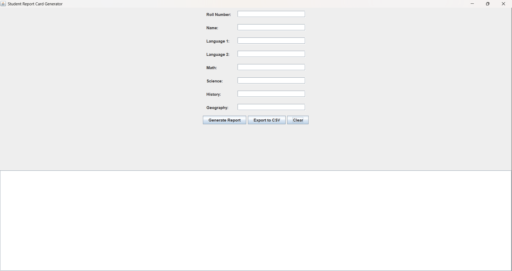
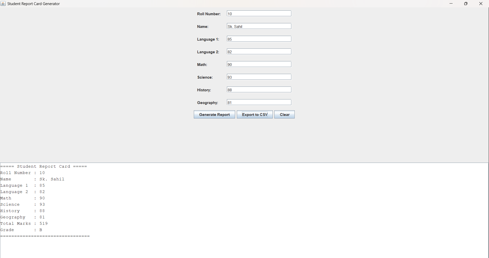
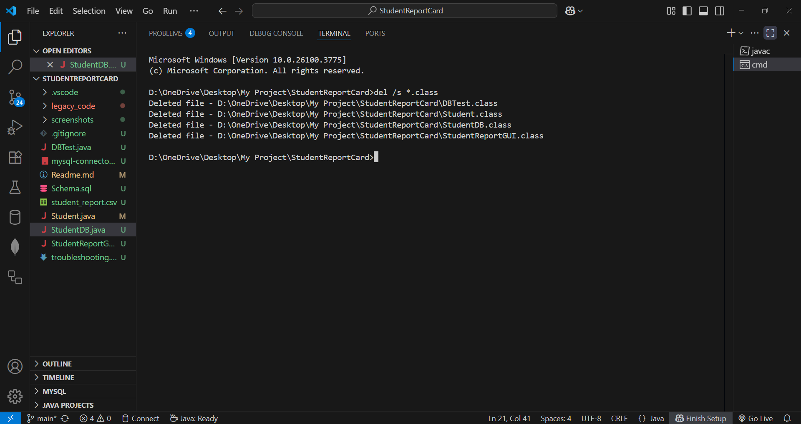
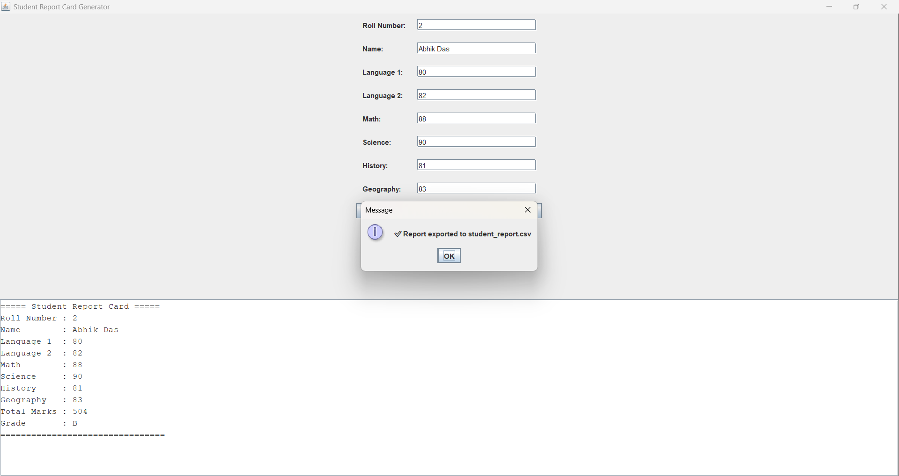

# 📝 Student Report Card Generator (Java + MySQL + GUI)

A Java Swing-based application to generate student report cards with total marks and grades, store the data in a MySQL database, and export the result as a CSV file.

---

## 🛠️ Features

- Accepts student name and marks for 6 fixed subjects:
- Language 1, Language 2, Math, Science, History, Geography
- Calculates total marks and assigns grade based on average
- Displays a formatted report in a scrollable GUI panel
- Inserts student data into a MySQL database using JDBC
- Supports exporting the generated report to studentreport.csv

---

## 🧠 Concepts Used

- **OOP Principles** – Modular classes: Student, StudentDB, StudentReportGUI
- **Java Swing** – GUI with JFrame, JTextField, JTextArea, JScrollPane, etc.
- **Exception Handling** – Handles input errors and DB exceptions gracefully
- **JDBC** – Connects to MySQL using PreparedStatement and JDBC driver
- **CSV File Writing** – Writes formatted student reports to a CSV file

---

## 📁 File Structure

```
📁 StudentReportCard/
│
├── Student.java                  # Handles student data & calculations
├── StudentDB.java                # JDBC logic for DB connection & insertion
├── StudentReportGUI.java         # GUI class for user input and report generation
├── DBTest.java                   # [Optional] Used for initial DB connection testing
├── Schema.sql                    # SQL file to create database and table
├── mysql-connector-j-8.3.0.jar   # MySQL JDBC driver
├── .gitignore                    # Ignores all *.class files
├── screenshots/                  # GUI + CSV + error popup screenshots
└── studentreport.csv             # Output CSV file (generated at runtime)
```

---

## 🛢️ MySQL Database Setup

1. Use MySQL Workbench / CLI to run `Schema.sql`
2. It creates:
   - Database: `student_report_db`
   - Table: `students`

```
CREATE DATABASE student_report_db;

USE student_report_db;

CREATE TABLE students (
    rollNo INT PRIMARY KEY,
    name VARCHAR(100),
    language1 INT,
    language2 INT,
    math INT,
    science INT,
    history INT,
    geography INT,
    total INT,
    grade VARCHAR(10)
);

```
3. Verify JDBC credentials match your setup in `StudentDB.java`
   ```
      String url = "jdbc:mysql://localhost:3306/student_report_db";
      String user = "your_username_here";
      String password = "your_password_here";
   ```

---

## 🚀 How to Compile and Run

1. Open terminal in project folder
2. Compile:
   ```
   javac -cp ".;mysql-connector-j-8.3.0.jar" *.java
   ```
3. Run GUI:
   ```
   java -cp ".;mysql-connector-j-8.3.0.jar" StudentReportGUI
   ```
    🪟 Use \: `instead of` ; `on Linux/Mac for classpath separator`.

---

## 🖼 Sample Screenshots (Inside `screenshots/` Folder)

✅ Student Report Card Generator – GUI Version
1. GUI – Initial Blank State



Clean UI before entering any student data.

2. Student GUI – Valid Entry



Generated report card of a student who passed.

3. Failed Student – GUI Report


Report of a student who failed in one or more subjects.

4. Empty Subject Field Error


Shows what happens if a subject mark is left blank.

5. Non-Numeric Input Error


User tried entering "avb" instead of a number.

6. Duplicate Roll Number (DB Constraint Violation)

.png)

Duplicate roll number error handled and shown properly.

7. Report Generation Success Popup


Popup confirming that report was generated and inserted into DB.

🛢️ Database Screenshots
8. MySQL Schema


Structure of the students table.

9. MySQL Table View with Inserted Data


Shows all the students' marks, total, and grade from DB.

10. Schema SQL File


Visual of the actual `Schema.sql` file used to create the table.

11. Compiled Class Removal (Clean Git Repo)



Shows `.class` files being removed before pushing to GitHub, keeping the repo clean.

🗃️ Legacy & Additional Screens
12. Legacy Version (CLI Output)

.png)

Previous `Main.java` CLI version before GUI upgrade.

📤 CSV Export Feature

The application supports exporting student report data to a CSV file named `student_report.csv`.

13. After clicking the "Export CSV" button:


14. Opened in Excel:


---

## ⚙️ Troubleshooting

During the development and upgrades of the Student Report Card Generator project, I encountered several technical issues that helped me gain deeper insights into Java, JDBC, GUI layouting, and file handling. Below is a list of problems and the steps taken to solve them:

🔧 1. JDBC Connection Not Working
- Problem: The application couldn't connect to the MySQL database.
Common Causes:
-   Wrong database name or case mismatch (Student_Report_DB vs student_report_db)
-   Incorrect port or MySQL not running
-   Password or username issues

- Fix:
-   Verified database name in JDBC URL:

```
    "jdbc:mysql://localhost:3306/your_database_here"
```
- Ensured MySQL service was running (mysql --version to confirm).
- Checked that the password used in code matched the real MySQL credentials:
```
  your_username_here  // Replace with your actual MySQL username  
your_password_here  // Replace with your actual MySQL password

```
🔧 2. CSV Export Not Working
- Problem: Clicking the "Export CSV" button showed no result or failed silently.
- Fixes:
-   Recompiled the .java files to generate updated .class files:

```
  javac *.java
```
- Ensured the file studentreport.csv was not open in Excel or another program during the export.
- Added a confirmation popup after export to notify the user:
```
JOptionPane.showMessageDialog(null, "Report exported successfully!");
```
🔧 3. GUI Report Not Displaying Properly
- Problem: The full student report wasn't visible, requiring scrolling.
Fixes:
-   Added JScrollPane to wrap the JTextArea.
-   Increased preferred size and rows for better display.
-   Tip message was added: "Scroll down to view full report."
- Future Suggestions:
-   Add auto-resize or split-view for a better layout.
-   Enable Save as PDF functionality.

🔧 4. .class Files Uploading to GitHub
- Problem: Compiled .class files were accidentally pushed to GitHub.
- Fix:
-   Added the following to .gitignore:
```
*.class
student_report.csv
```
-   Deleted old .class files to avoid confusion with outdated compiled versions.
-   Recompiled freshly before every commit.

🔧 5. Text Alignment in GUI Input Form
- Problem: Labels and text fields were misaligned in the input form, causing an unprofessional look.
- Fix:
-   Used GridBagLayout with consistent constraints (GridBagConstraints) for perfect control.
-   Applied proper padding (insets) and alignment (anchor) for each element.
-   Verified on different screen sizes for layout consistency.

🔧 6. Unexpected Output or Missing Report Fields
- Problem: Sometimes the output report missed student details or printed null / 0 values.
- Fix:
-   Checked if all required fields (roll number, name, and marks for 6 subjects) were filled before proceeding.
-   Added validation logic to prevent empty input:
```
if (name.isEmpty() || subject1.isEmpty() || ...) {
    JOptionPane.showMessageDialog(null, "Please fill all the fields.");
    return;
}
```
---

## 🧑‍🎓 Final Thoughts

This project helped me:
- Build confidence in Java Swing + JDBC integration
- Understand modular design with OOP
- Solve real-world problems like database syncing, file handling, and GUI responsiveness
- Prepare for Java-based interviews and academic projects

---

## 🧑‍💻 Learning Outcome
- GUI and JDBC in Java with real-world debugging
- MySQL CRUD basics and exception handling
- CSV writing in Java using FileWriter and PrintWriter
- Clear separation of logic across files

---

## 📜 License
Open-source. Free to use for learning and academic purposes.

---
